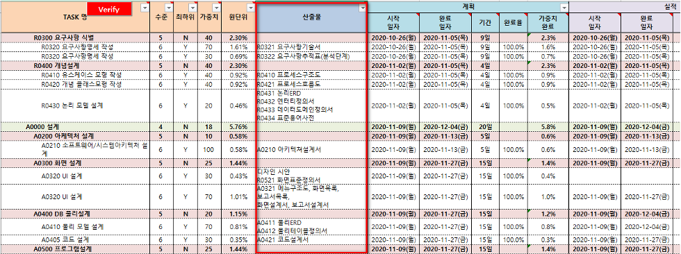

<link rel="stylesheet" type="text/css" href="../assets/style.css">

# SWM 프로젝트 5W1H 그리고 인공지능의 성공적인 시작

> 22.04.16  
> 이규영 멘토님

## 5W1H

- Why
- Who
- What
- When
- Where
- How

## 팀빌딩하기 위해 자신이 어떤 상태인지 알기

- 내가 SWM에 참여하는 이유?
    - 창업?
    - 취업?
- SWM의 프로젝트로 이루고자하는 목표
    - 단순 수료?
    - 10% 우수자?
- 프로젝트의 방향성
    - 기술적 프로젝트?
    - 사업적 프로젝트?
    
    ⇒ 하나에 치중하는 것보단 둘의 밸런스를 맞추는 것이 중요하다.
    

## 일정계획의 중요성

“**현실적인**” 일정 수립 및 단계별 산출물 설정 중요 → WBS 작성 필요

### WBS (Work Breakdown Structure, 작업분해구조)

프로젝트 팀이 프로젝트 목표를 달성하고 필요한 전달산출물을 만들기 위한 총 업무 범위의 계층적 분해

*출처: PMBOK*

### 진척 관리의 중요성

- 현재 일정의 선행, 후행 판단
- 누적 진척율 산정 필요

<h2>🔑 정리</h2>

<ul>
<li> 내가 소프트웨어 마에스트로 참여하는 목적을 분명히 한다. </li>
<li> 팀원들과 솔직한 의사소통을 통해 목적이 맞거나 혹은 함께 상생할 수 있는 팀원들과 팀을 구성한다. </li>
<li> 프로젝트 진행에 가장 중요한 것은 주어진 데드라인까지 실현 가능한 목표를 정하고 이를 세분화 하는 것이다. </li>
</ul>

