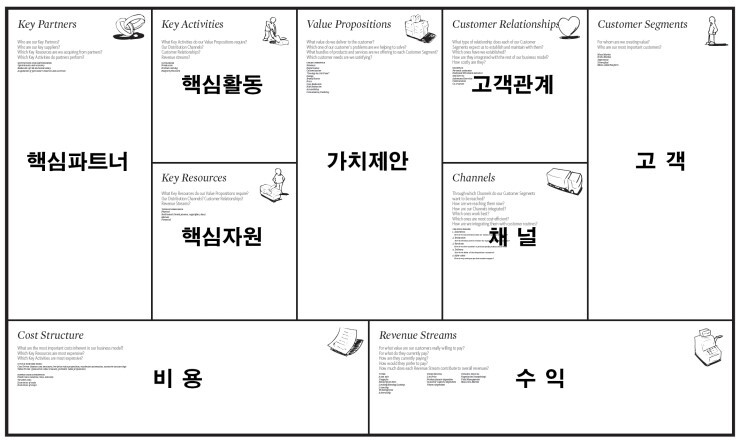

# 프로젝트 기획

> 22.04.18  
> 김현 멘토님

## 프로젝트 기획

- 애자일(Agile)
    - Waterfall 방식과의 비교
    - 팀의 프로젝트 throughput을 기반으로 한 프로젝트 진행
- 프로젝트의 목표
    - 욕심 내지 말것
    - 실제 개발할 수 있는 기간은 2-3달뿐
- 비즈니스모델캔버스
- 페르소나
    - 페르소나를 어떻게 움직일 것인가

## 프로젝트의 방향성

**“지속적 가치 제공"** 이 중요하다.

## 구글 아이디어 스케치 방법

1. Boot up
    1. 일종의 brain storming
    2. mind map
2. Doodle
    1. 아이디어 구체화 
    2. 그림, 도표 등을 이용해 시각화하기
    3. 20분동안 아이디어 생성 → 3분간 검토 → 가장 마음에 드는 아이디어에 동그라미
3. CRAZY 8S
    1. 종이 한 장을 3번 접어 8칸 생성
    2. 1칸당 60초씩 할당해 아이디어 스케치
    3. 가장 마음에 드는 아이디어를 변형 시켜 8개의 아이디어 스케치 생성
4. Solution Sketch
    1. 팀원끼리 스케치 공유(익명)
    2. 이때 아이디어는 누구나 이해할 수 있어야한다
    3. 인상깊은 제목, 글로 아이디어를 설명하기

## 비즈니스 캔버스 모델

경영관리도구 중 하나

**“가치제안"** 을 중심으로

1. 가치를 고객에게 전달하는 전반부
2. 가치를 생산해내는 후반부

이렇게 두 파트로 나눌 수 있다.

### 가치제안

기업이 고객을 위해 창출해내는 가치. 상품/서비스를 통한 기능적인 가치부터 사회적, 감정적 가치도 포함한다.

### 전반부

- 고객
- 고객관계
    
    고객을 확보하고 유지하기 위해 사용되는 방법
    
    → 고객을 어떻게 유치할 것인가?
    
    → 고객과 어떻게 상호작용할 것인가?
    
    → 고객을 어떻게 유지할 것인가?
    
- 채널
    
    기업의 가치를 고객에게 전달하는 방법
    
    → “가치 전달 단계"에 따라 어떤 채널을 이용할 것인지 생각해봐야 한다.
    
    - 인식
    - 평가
    - 구매
    - 사후 관리
    
    ...etc
    
- 수익
    
    수익모델
    

### 후반부

- 핵심자원
- 핵심활동
    
    가치를 만들어내기 위해 필요한 활동으로 제작과정, 고객이해, 인재 찾기 등등이 있다.
    
- 핵심파트너
    
    사업이 잘 진행되기 위해 필요한 외부 이해관계자들
    
- 비용

## reference

* [https://blog.wishket.com/아이디어스케치-방법-그린클라이언트/](https://blog.wishket.com/%EC%95%84%EC%9D%B4%EB%94%94%EC%96%B4%EC%8A%A4%EC%BC%80%EC%B9%98-%EB%B0%A9%EB%B2%95-%EA%B7%B8%EB%A6%B0%ED%81%B4%EB%9D%BC%EC%9D%B4%EC%96%B8%ED%8A%B8/)
* [https://brunch.co.kr/@givemore/3](https://brunch.co.kr/@givemore/3)